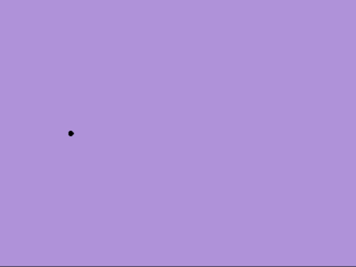

# Voronoi-Experiences

A fun and interactive, aesthetically pleasing, dynamic Voronoi-Experience. Voronoi-Experiences allows users to add dynamic Voronoi sites to a WebGL canvas. Each Voronoi site moves along one of six predefined paths while the Voronoi diagram is seamlessly updated. Be sure to use the orbit mode to take a look at how we are taking advantage of cones to reduce the time complexity. That is, instead of calculating the Voronoi diagram after each timestamp in O(nlog(n)), we merely represent each Voronoi site as a black sphere superimposed on the tip of a colored cone. Since the edges of the Voronoi diagram are simply the intersection of adjacent cones, the diagram is updated as a consequence of moving the cones in O(n).

Experience it yourself at www.voronoi-experiences.com (WebGL required; Sound recommended)

---

# Demo
##### Normal mode

##### Party mode

# Controls
  - left-click - add point
  - right click and drag - shift camera view
  - mouse wheel - zoom
  - mouse wheel (held down) - pan
  - space - reset camera
  - s-key - change path type to star
  - c-key - change path type to circle
  - b-key - change path type to heart
  - l-key - change path type to horizontal line
  - v-key - change path type to vertical line
  - p-key - change path type to static
  - h-key - toggle hiding the customization gui
  - u-key - undo point
  - d-key - toggle party mode
  
# Features
#### Customize
 - Path 
 - Size
 - Speed
 - Color
 - Location
 
#### Party Mode
 - Blacklight
 - Strobe light
 - Music
 
#### Orbit
 - Zoom in & out of the canvas
 - Rotate and pan the view
 
# Predefined Paths
###### Circle

###### Star

###### Heart

###### Vertical Line

###### Horizontal Line

###### Static Point

